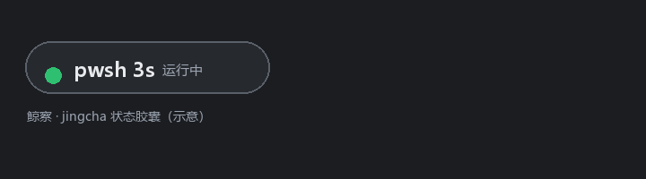
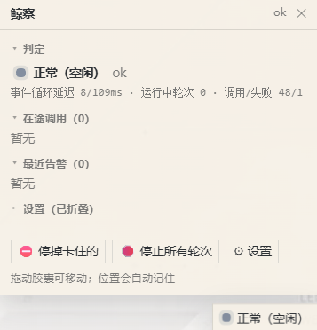
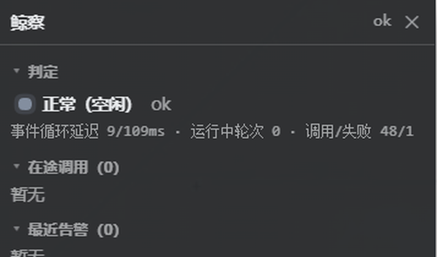

<div align="center">


<h1>鲸察 · dsh-jingcha</h1>

<p><strong>DSH 运行时监察插件：工具调用 / 事件循环 / 错误风暴实时体检 + 按调用强制停止 + 右下角红绿灯挂件</strong></p>

<p>
<a href="https://github.com/QTATQ233/dsh-jingcha/actions/workflows/ci.yml"></a>
<a href="LICENSE"></a>
<a href="https://github.com/topics/dsh-plugin"></a>

<a href="CONTRIBUTING.md"></a>

= 18" />

<a href="https://github.com/QTATQ233/dsh-jingcha/stargazers"></a>
</p>

<p>
<a href="README.md">中文</a> · <a href="README.en.md">English</a> · <a href="docs/">文档</a> · <a href="CHANGELOG.md">更新日志</a>
</p>

<p></p>
<p>




</p>

<p>💡 <strong>如果这个项目帮到了你，点个 ⭐ 就是最大的支持！</strong></p>

</div>

---

## 📖 目录

- [它解决什么问题](#它解决什么问题)
- [它长什么样](#它长什么样)
- [30 秒上手](#30-秒上手)
- [功能一览](#功能一览)
- [判定规则](#判定规则)
- [配置](#配置)
- [安全边界](#安全边界)
- [零 token](#零-token)
- [它是怎么接进去的](#它是怎么接进去的)
- [架构与状态机](#架构与状态机)
- [接口与 Schema](#接口与-schema)
- [示例](#示例)
- [二次开发](#二次开发)
- [常见问题](#常见问题)
- [文档](#文档)
- [术语表](#术语表)
- [路线图](#路线图)
- [贡献](#贡献)
- [许可](#许可)

---

<a id="它解决什么问题"></a>
## 🎯 它解决什么问题

| 痛点 | 以前的处境 | 有了鲸察 |
|---|---|---|
| 工具调用跑着没动静 | 界面只说「运行中」，分不清是慢、死了，还是在等你点审批 | 快照 + 事件流给出**判定与理由**（慢 / 挂起 / 卡住 / 没有输出 / 等待审批 / 错误风暴） |
| 想停掉某个跑飞的调用 | 只能停整个轮次，别的活一起陪葬 | **按 callId 强停**单个调用，或「停掉卡住的」「停止所有轮次」（带二次确认） |
| 出问题想复盘 | 没有现场 | 每次调用一条事件（工具、参数摘要、耗时、结果、错误分类）→ events.jsonl |
| 不想被插件吃 token | 工具一注册就占上下文 | 默认 <strong>toolEnabled: false</strong>，模型完全看不到它，<strong>0 token</strong> |

<a id="它长什么样"></a>
## 🖼️ 它长什么样

| 浅色 | 深色 |
|---|---|
|  |  |

- **胶囊**：状态点 + 判定文字（有在途调用时显示「pwsh 1m33s」）；拖动可移动，位置自动记住；
- **面板**：判定（含事件循环延迟与调用计数）/ 在途调用（每条带 ⛔ 强停）/ 最近告警 / 设置 / 时间线，五段可折叠；
- **灯色**：按调用时长分级 —— 不超过黄灯秒是绿、不超过红灯秒是黄、超过就是红（呼吸动画）；
- **深色与浅色**：胶囊、面板、色板共用**同一个基底色**派生，字色跟着底色走，不会出现「深底白字」。

<a id="30-秒上手"></a>
## 🚀 30 秒上手

```powershell
# 官方通道（装完需要重启 dsh）
dsh plugin --profile web add github:QTATQ233/dsh-jingcha

# 自检（零依赖，不需要 dsh 在跑）
node test/verify.mjs          # 179 项
node test/verify-client.mjs   # 111 项（挂件，DOM 桩）
```

不想走插件通道？仓库里也有 tools/install.ps1：建 junction + 改 profile manifest，**改前自动备份、可整体回滚**。
安装/卸载/分享前的安全检查见 [docs/SHARING.md](docs/SHARING.md)。

<a id="功能一览"></a>
## ✨ 功能一览

- **0.5.0 新特性**：判定规则可编排（内置 8 条 + 第三方 `registerRule` 注册）、`?session=` 会话维度过滤、挂件 5 分钟迷你时间线、强停取证卡；
- **监察**：在 tools/pre-execute、tools/execute、tools/result 三层只读观察，记录耗时、结果字节、错误分类；
- **判定**：慢 / 挂起 / 卡住 / 静默（有 agent 在跑却没有输出）/ 等待审批 / 错误风暴 / **内存泄漏预警** / 插件自身报错；
- **强停**：融合一个属于鲸察的 AbortController（**上游取消语义不变**），并且**在 pre-execute 就登记** ——
  所以嵌套子调用（父 id 加 :ptc: 序号）也能停；停不掉时返回人话原因，绝不错杀父调用；
- **挂件**：可拖动、按调用时长分级变色、异常右侧弹提示、悬停省略号看全文（**不闪烁**）、五宫格复位、
  深浅色统一、隐藏后原位置可找回、Ctrl+Shift+J 快捷键；
- **接口**：status / kill / stop / settings 四个端点，只监听回环 + Host 白名单 + 拒跨站来源 + 变更类只收 POST JSON；
- **落盘**：status.json（原子替换的快照）+ events.jsonl（追加式事件流，超 8MB 自动轮转）。

<a id="判定规则"></a>
## 🧭 判定规则

| 判定 | 触发条件（默认阈值） | 建议动作 |
|---|---|---|
| 慢 | 单次调用超过 30s（slowCallMs） | 看看是不是正常的长任务 |
| 挂起 | 在途超过 2min（hangCallMs） | 关注，可能要停 |
| **卡住** | 在途超过 5min（stuckCallMs）**且**期间没有产出 | 点「停掉卡住的」 |
| 没有输出 | 有 agent 在跑但 90s 内没有流式帧 / 会话事件 / 工具结果 | 检查模型侧 |
| 等待审批 | pre-execute 卡在审批超过 20s | 去界面点确认，别误判成卡死 |
| 错误风暴 | 连续 3 次失败（errorStormCount） | 停手，先看错误分类 |
| 内存泄漏预警 | RSS 连续 5 个心跳递增，且增幅超过 10%（memoryLeakWindow / memoryLeakGrowth） | 确认是不是真泄漏；长任务本身在涨就调大窗口或阈值 |
| 插件自身报错 | 鲸察自己抛异常 | 报告 bug（它保证**不反过来搞坏工具调用**） |

> 判定规则可编排：内置 8 条可用 `disabledRules` 按 id 停用，第三方可用 core 的 `monitor.registerRule({ id, evaluate })` 注册（配 `unregisterRule` / `setRuleEnabled` / `listRules`）；升级语义与失败隔离见 [docs/ARCHITECTURE.md](docs/ARCHITECTURE.md)。

<a id="配置"></a>
## ⚙️ 配置

全部在 [cordis.patch.yml](cordis.patch.yml)（每项都有中文注释）：

| 键 | 默认 | 说明 |
|---|---|---|
| dataDir | %DSH_HOME%\data\dsh-jingcha | 数据目录（status.json / events.jsonl / widget-settings.json） |
| displayName | 鲸察 | 控制台前缀与报告标题 |
| toolEnabled | false | 是否注册模型可见的查询工具（打开后每请求多约 176 token） |
| slowCallMs / hangCallMs / stuckCallMs | 30s / 2min / 5min | 慢 / 挂起 / 卡住 |
| silenceMs | 90s | 「没有输出」判定 |
| approvalWarnMs | 20s | 等待审批提示 |
| autoKillAfterMs | 0（关） | 自动强停阈值；**同时要求没有产出**，避免误杀慢任务 |
| memoryLeakWindow / memoryLeakGrowth | 5 / 0.1 | 内存泄漏预警：连续多少个心跳递增、增幅超过多少才算 |
| previewArgs / redactPreviews | true / true | 是否记录参数摘要 / 是否对 token、password 一类片段打码 |
| apiToken | 空 | 设了就要求 x-jingcha-token 头（多用户机器建议设） |
| disabledRules | [] | 停用内置判定规则的 id 列表（内置 8 条见 [docs/ARCHITECTURE.md](docs/ARCHITECTURE.md)）；第三方规则用 `monitor.registerRule()` 注册 |

<a id="安全边界"></a>
## 🔒 安全边界

- 四个接口**统一过栅栏**：只认回环地址、Host 必须在 127.0.0.1 / localhost / ::1 白名单（挡 DNS rebinding）、
  拒绝带 Origin 或 Sec-Fetch-Site: cross-site 的请求、**变更类接口只接受 POST + application/json**
  （挡 img 标签一发即杀与跨站表单）、可选 apiToken；
- 插件**不联网、无第三方依赖、不做动态执行**；客户端全程 textContent（无 XSS 面）；
- events.jsonl / status.json 含**工具参数摘要**（默认截断 120 字符并对敏感片段打码），分享前先看一眼，或用 previewArgs: false 关掉；
- 残余风险：回环等于「本机全体」，同机其它账号/进程仍可访问 —— 多用户环境请设 apiToken。
- 观测数据本身是敏感的：`events.jsonl` / `status.json` 含**参数摘要**（≤120 字、默认脱敏），分享前先看一眼，或用 `previewArgs: false` 关掉；
- 脱敏默认会把 `--password x`、`token=…`、`Bearer …` 这类片段遮成 `[已脱敏]`，**过脱敏是故意的**（`-p 8080` 也会被遮），要放松就改 `redactPatterns`；
- 0.4.3 独立安全审查（运行时 + 工具链两路）结论：无严重/高危；已修脱敏覆盖、采样越界、token 常量时间比较、发布自检同源降级等问题（见 CHANGELOG）。

细节见 [SECURITY.md](SECURITY.md)。

<a id="零-token"></a>
## 🪙 零 token

默认不注册任何模型可见的工具（status.json 里 extras.tool 为 null），事件流与挂件都不进模型上下文 —— 不花一分钱 token。
如果你希望会话里能直接问「现在卡在哪」，再把 toolEnabled 打开（代价：每请求多约 176 token 的工具说明 + 每次查询约 0.5k token 的报告）。

<a id="它是怎么接进去的"></a>
## 🧩 它是怎么接进去的

```
lib/core.js    纯逻辑：判定、统计、状态机（零依赖，可单测）
lib/index.js   宿主接线：工具流水线观察、融合强停信号、HTTP 路由、心跳
lib/sink.js    落盘：status.json 原子写 + events.jsonl 追加与轮转
lib/client.js  浏览器挂件（单文件 bundle，零 require）
```

- **强停原理**：在 pre-execute 给一次调用装上属于鲸察的 AbortController 并替换 exec.signal，DSH 派发时会把
  「上游 callerSignal」与「我们的信号」融合 —— 因此**上游取消照旧、我们也能主动掐断**；调用结束再还原并摘掉登记；
- **挂件灯色**按调用时长在客户端即时计算（不等宿主），判定状态另走一路；
- 规格与验收清单：[lib/WIDGET-SPEC.md](lib/WIDGET-SPEC.md)。

<a id="二次开发"></a>
## 🛠️ 二次开发

[docs/EXTENDING.md](docs/EXTENDING.md) 给了五类改动的最小清单（加判定规则 / 加路由 / 加面板分区 / 加设置项 / 换语言换配色），
通常只需要动 2 到 6 处；三条必踩的坑也写在里面（例如**轮询里不要重建交互控件**）。

<a id="常见问题"></a>
## ❓ 常见问题

- **停不下来？** 忽略 exec.signal 的同进程死循环无法硬杀（插件只能中止信号），但 pwsh 之类的子进程会被真的杀掉；
  嵌套调用若只有父调用在跑，插件会明确拒绝，而不是误杀父调用；
- **会不会反过来搞坏工具调用？** 所有监控路径都包在 safe() 里，异常自己吞掉并计入 pluginErrors，不影响工具结果；
- **数据长多大？** events.jsonl 超 8MB 自动轮转保留一份（约 16MB 上限），status.json 始终只有一份快照；
- **要重启吗？** 宿主侧代码改动需要重启 dsh；只改挂件（lib/client.js）刷新页面即可。

<a id="架构与状态机"></a>
## 🏗️ 架构与状态机

数据流、五个状态之间的迁移条件、13 种 reason kind 的严重度与去处，以及"为什么这么设计"的六条取舍，
都画在 **[docs/ARCHITECTURE.md](docs/ARCHITECTURE.md)**（含三张 Mermaid 图：组件数据流、判定状态机、规则编排）。

- **优先级**：`stalled` > `erroring` > `degraded` > `busy` / `ok` —— 一个卡住的调用不会被一堆小告警淹没；
- **强停原理**：pre-execute 就装上自己的 AbortController 并替换 `exec.signal`，DSH 派发时与 callerSignal 融合，
  上游取消照旧、我们也能主动掐断；调用结束还原；
- **只读优先**：所有监控路径包在 `safe()` 里，异常只记账，绝不改写工具结果与取消语义。

<a id="接口与-schema"></a>
## 🔌 接口与 Schema

| 产物 | 文件 | 用途 |
|---|---|---|
| OpenAPI 3.1 | **[docs/openapi.yaml](docs/openapi.yaml)** | 四个本机接口的完整契约（含准入规则、错误码、全部响应字段） |
| Config JSON Schema | **[docs/config.schema.json](docs/config.schema.json)** | `cordis.patch.yml` 里 `config:` 的 32 个字段：类型 / 默认值 / 取值范围 / 说明 |

接口速览（全部要求回环 + Host 白名单；变更类要 POST + `application/json`）：

```http
GET  /api/jingcha/status      # 实时判定 + 在途调用 + 会话汇总 + 规则表 + 最近告警；?session=<id> 只看某个会话
POST /api/jingcha/kill        # { "callId": "..." } 或 { "scope": "stalled|all" }
POST /api/jingcha/stop        # 停掉所有在跑的轮次
GET  /api/jingcha/settings    # 读挂件设置（含默认值）
POST /api/jingcha/settings    # 写挂件设置（字段白名单 + 数值夹紧后落盘）
```

<a id="示例"></a>
## 🧪 示例

[examples/](examples/) 里五个零依赖脚本，直接 `node` 跑：

| 脚本 | 用途 |
|---|---|
| [01-read-status.mjs](examples/01-read-status.mjs) | 读快照打印判定；状态不是 ok/busy 时退出码 1（可挂定时任务 / CI） |
| [02-watch-http.mjs](examples/02-watch-http.mjs) | 每 2 秒拉一次接口，只在判定变差时打印 |
| [03-kill-runaway.mjs](examples/03-kill-runaway.mjs) | 列出在途调用并强停指定 / 最久的那个；**默认 dry-run** |
| [04-custom-verdict.mjs](examples/04-custom-verdict.mjs) | 用 `registerRule` 注册一条自定义判定规则（含启用/停用与升级语义） |
| [04a-old-way.mjs](examples/04a-old-way.mjs) | 0.5 之前的兼容写法：直接 `createMonitor` 喂事实、拿 verdict |

<a id="术语表"></a>
## 📔 术语表

判定 / 状态 / 理由 / 告警 / 在途 / 卡住 / 静默 / 融合信号 / 嵌套子调用 / pts … 全部中英对照见 **[docs/GLOSSARY.md](docs/GLOSSARY.md)**。

<a id="路线图"></a>
## 🗺️ 路线图

**[ROADMAP.md](ROADMAP.md)**：0.5（判定规则可编排 / 会话维度过滤 / 停后取证 / 挂件时间线）已落地，见 [CHANGELOG.md](CHANGELOG.md)；下一步 0.6（i18n / 配置校验 / 指标导出）· 1.0（契约单一化 / 静默失败可观测）。
明确不做：自动改工具调用、默认联网上报、硬杀同进程死循环、默认把观测塞进模型上下文。
<a id="文档"></a>
## 📚 文档

| 文件 | 内容 |
|---|---|
| [docs/SHARING.md](docs/SHARING.md) | 装给别人 / 卸载 / 分享前的安全检查 |
| [docs/EXTENDING.md](docs/EXTENDING.md) | 加判定规则 / 路由 / 面板分区 / 设置项的最小改动清单 |
| [docs/PUBLISHING.md](docs/PUBLISHING.md) | 维护者发布流程（复制脱敏 + 隐私自检 + 推送） |
| [lib/WIDGET-SPEC.md](lib/WIDGET-SPEC.md) | 挂件规格与验收清单 |
| [docs/ARCHITECTURE.md](docs/ARCHITECTURE.md) | 架构数据流 + 判定状态机（Mermaid） |
| [docs/GLOSSARY.md](docs/GLOSSARY.md) | 术语表（中英对照） |
| [docs/openapi.yaml](docs/openapi.yaml) | 接口的 OpenAPI 3.1 契约 |
| [docs/config.schema.json](docs/config.schema.json) | 配置的 JSON Schema |
| [examples/](examples/) | 五个可直接运行的零依赖示例 |
| [ROADMAP.md](ROADMAP.md) | 路线图与「明确不做」 |
| [CODE_OF_CONDUCT.md](CODE_OF_CONDUCT.md) | 贡献者公约 |
| [CHANGELOG.md](CHANGELOG.md) | 版本记录 |

<a id="贡献"></a>
## 🤝 贡献

见 [CONTRIBUTING.md](CONTRIBUTING.md)。简单说：提交前保证三套自检全绿、隐私自检「通过」，
并且守住三条铁律（只观察不改写 / 设置项两端同步 / 轮询里不重建交互控件）。Issue 与 PR 都欢迎。

<a id="许可"></a>
## 📄 许可

MIT —— 见 [LICENSE](LICENSE)。参与前请先读 [CODE_OF_CONDUCT.md](CODE_OF_CONDUCT.md)。

---

<a id="star-history"></a>
## ⭐ Star History

<a href="https://star-history.com/#QTATQ233/dsh-jingcha&Date">

</a>

## 📣 分享

<a href="https://twitter.com/intent/tweet?text=%E9%B2%B8%E5%AF%9F%20dsh-jingcha%EF%BC%9ADSH%20%E8%BF%90%E8%A1%8C%E6%97%B6%E7%9B%91%E5%AF%9F%E6%8F%92%E4%BB%B6%EF%BC%8C%E5%8F%AF%E5%BC%BA%E5%88%B6%E5%81%9C%E6%8E%89%E5%8D%A1%E4%BD%8F%E7%9A%84%E5%B7%A5%E5%85%B7%E8%B0%83%E7%94%A8&url=https%3A%2F%2Fgithub.com%2FQTATQ233%2Fdsh-jingcha">
</a>
<a href="https://t.me/share/url?url=https%3A%2F%2Fgithub.com%2FQTATQ233%2Fdsh-jingcha&text=%E9%B2%B8%E5%AF%9F%20dsh-jingcha">
</a>
<a href="https://service.weibo.com/share/share.php?url=https%3A%2F%2Fgithub.com%2FQTATQ233%2Fdsh-jingcha&title=%E9%B2%B8%E5%AF%9F%20dsh-jingcha%EF%BC%9ADSH%20%E8%BF%90%E8%A1%8C%E6%97%B6%E7%9B%91%E5%AF%9F%E6%8F%92%E4%BB%B6">
</a>
<a href="https://github.com/QTATQ233/dsh-jingcha">
</a>

