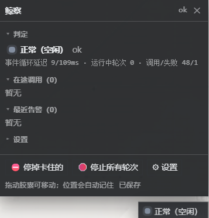

# 鲸察 · dsh-jingcha

[](https://github.com/you233/dsh-jingcha/actions/workflows/ci.yml)
[](LICENSE)
[](https://github.com/topics/dsh-plugin)
[](#零-token)

> **DSH 运行时监察插件**：实时判断工具调用是**正常、卡住、还是出了 bug**；发现异常能**按调用强制停止**（含嵌套子调用）；
> 右下角一枚**红绿灯挂件**随时看状态 —— 默认 **0 token**，不占模型上下文。

|  |  |
|---|---|
|  |  |
| 浅色（胶囊 + 面板） | 深色（胶囊 / 面板 / 色板同一套配色） |

## 它解决什么问题

| 痛点 | 以前的处境 | 有了鲸察 |
|---|---|---|
| 工具调用跑着没动静 | 界面只说「运行中」，分不清是慢、死了，还是在等你点审批 | 快照 + 事件流给出**判定与理由**（慢 / 挂起 / 卡住 / 没有输出 / 等待审批 / 错误风暴） |
| 想停掉某个跑飞的调用 | 只能停整个轮次，别的活一起陪葬 | **按 callId 强停**单个调用，或「停掉卡住的」「停止所有轮次」（带二次确认） |
| 出问题想复盘 | 没有现场 | 每次调用一条事件（工具、参数摘要、耗时、结果、错误分类）→ events.jsonl |
| 不想被插件吃 token | 工具一注册就占上下文 | 默认 **toolEnabled: false**，模型完全看不到它，**0 token** |

## 功能一览

- **监察**：在 tools/pre-execute、tools/execute、tools/result 三层只读观察，记录耗时、结果字节、错误分类；
- **判定**：慢 / 挂起 / 卡住 / 静默（有 agent 在跑但没有任何输出）/ 等待审批 / 错误风暴 / 插件自身报错；
- **强停**：融合一个属于鲸察的 AbortController（上游取消语义不变），**在 pre-execute 就登记**，
  所以嵌套子调用（父 id 加 :ptc: 序号）也能停；停不掉时返回人话原因（例：只有父调用在跑时不会误杀）；
- **挂件**：可拖动（位置自动记住）、按调用时长分级变色（黄/红灯秒可调）、异常右侧弹提示、
  悬停省略号看全文（**不闪烁**）、五宫格复位、深浅色统一、隐藏后原位置可找回、Ctrl+Shift+J 快捷键；
- **接口**：status / kill / stop / settings 四个 HTTP 端点，只监听回环 + Host 白名单 + 拒跨站来源 + 变更类只收 POST JSON（见「安全边界」）；
- **落盘**：status.json（原子替换的快照）+ events.jsonl（追加式事件流，8MB 自动轮转）。

## 30 秒上手

```powershell
# 官方通道（装完需要重启 dsh）
dsh plugin --profile web add github:you233/dsh-jingcha

# 自检（两套零依赖，不需要 dsh 在跑）
node test/verify.mjs          # 107 项
node test/verify-client.mjs   #  90 项（挂件，DOM 桩）
```

不想用插件通道？仓库里也有 tools/install.ps1（建 junction + 改 profile manifest，自动备份，可整体回滚）。
细节见 [docs/SHARING.md](docs/SHARING.md)。

## 判定规则

| 判定 | 触发条件（默认阈值） | 建议动作 |
|---|---|---|
| 慢 | 单次调用超过 30s（slowCallMs） | 看看是不是正常的长任务 |
| 挂起 | 在途超过 2min（hangCallMs） | 关注，可能要停 |
| **卡住** | 在途超过 5min（stuckCallMs）**且**期间没有产出（progressEveryMs） | 点「停掉卡住的」 |
| 没有输出 | 有 agent 在跑但 90s 内没有任何流式帧 / 会话事件 / 工具结果（silenceMs） | 检查模型侧 |
| 等待审批 | pre-execute 卡在审批超过 20s（approvalWarnMs） | 去界面点确认，别误判成卡死 |
| 错误风暴 | 连续 3 次失败（errorStormCount） | 停手，先看错误分类 |
| 插件自身报错 | 鲸察自己抛异常 | 报告 bug（它保证不反过来搞坏工具调用） |

## 配置（cordis.patch.yml）

| 键 | 默认 | 说明 |
|---|---|---|
| dataDir | %DSH_HOME%\data\dsh-jingcha | 数据目录（status.json / events.jsonl / widget-settings.json） |
| displayName | 鲸察 | 控制台前缀与报告标题 |
| toolEnabled | false | 是否注册模型可见的查询工具（打开后每个请求多约 176 token） |
| slowCallMs / hangCallMs / stuckCallMs | 30s / 2min / 5min | 慢 / 挂起 / 卡住 |
| silenceMs | 90s | 「没有输出」判定 |
| approvalWarnMs | 20s | 等待审批提示 |
| autoKillAfterMs | 0（关） | 自动强停阈值；**同时要求没有产出**，避免误杀慢任务 |
| previewArgs / redactPreviews | true / true | 是否记录参数摘要 / 是否对 token、password 一类片段打码 |
| apiToken | 空 | 设了就要求 x-jingcha-token 头（多用户机器建议设） |

每一项都在 [cordis.patch.yml](cordis.patch.yml) 里带中文注释。

## 安全边界

- 四个接口**统一过栅栏**：只认回环地址、Host 必须在 127.0.0.1 / localhost / ::1 白名单（挡 DNS rebinding）、
  拒绝带 Origin 或 Sec-Fetch-Site: cross-site 的请求、**变更类接口只接受 POST + application/json**
  （挡 img 标签一发即杀与跨站表单）、可选 apiToken；
- 插件**不联网、无第三方依赖、不做动态执行**；客户端全程 textContent（无 XSS 面）；
- events.jsonl / status.json 含**工具参数摘要**（默认截断 120 字符并对敏感片段打码）；分享前先看一眼，或用 previewArgs: false 关掉；
- 残余风险：回环等于「本机全体」，同机其它账号/进程仍可访问 —— 多用户环境请设 apiToken。

## 它是怎么接进去的

```
lib/core.js    纯逻辑：判定、统计、状态机（零依赖，可单测）
lib/index.js   宿主接线：工具流水线观察、融合强停信号、HTTP 路由、心跳
lib/sink.js    落盘：status.json 原子写 + events.jsonl 追加与轮转
lib/client.js  浏览器挂件（单文件 bundle，零 require）
```

- 强停原理：在 pre-execute 给一次调用装上属于鲸察的 AbortController 并替换 exec.signal，
  DSH 派发时会把「上游 callerSignal」与「我们的信号」融合，因此**上游取消照旧、我们也能主动掐断**；
  调用结束（execute 的 finally 或 result 阶段）再还原并摘掉登记；
- 挂件的红绿灯按**调用时长**着色（客户端即时算，不等宿主），判定状态另有一路；
- 细节：[lib/WIDGET-SPEC.md](lib/WIDGET-SPEC.md)（挂件规格）、[docs/EXTENDING.md](docs/EXTENDING.md)（二次开发最小改动清单）。

## 自检

```powershell
node test/verify.mjs          # 107 项：判定逻辑 / 假 ctx 接线 / 路由栅栏 / 强停（含嵌套调用）/ 契约一致性
node test/verify-cordis.mjs   #  13 项：真 cordis 的 inject 握手 / waterfall 透传 / fiber 卸载（需 DSH_CORDIS）
node test/verify-client.mjs   #  90 项：挂件（DOM 桩，无需浏览器）
```

CI 每次 push 会跑其中零依赖的部分，见 [.github/workflows/ci.yml](.github/workflows/ci.yml)。

<a name="零-token"></a>
## 零 token

默认不注册任何模型可见的工具（status.json 里 extras.tool 为 null），事件流与挂件都不进模型上下文 —— 不花一分钱 token。
如果你希望会话里能直接问「现在卡在哪」，再把 toolEnabled 打开（代价：每请求多约 176 token 的工具说明 + 每次查询约 0.5k token 的报告）。

## 文档

| 文件 | 内容 |
|---|---|
| [docs/SHARING.md](docs/SHARING.md) | 装给别人 / 卸载 / 分享前的安全检查 |
| [docs/EXTENDING.md](docs/EXTENDING.md) | 加判定规则 / 路由 / 面板分区 / 设置项的最小改动清单 |
| [docs/PUBLISHING.md](docs/PUBLISHING.md) | 维护者发布流程（复制脱敏 + 隐私自检 + 推送） |
| [lib/WIDGET-SPEC.md](lib/WIDGET-SPEC.md) | 挂件规格与验收清单 |
| [CHANGELOG.md](CHANGELOG.md) | 版本记录 |

## 常见问题

- **停不下来？** 忽略 exec.signal 的同进程死循环无法硬杀（插件只能中止信号），但 pwsh 之类的子进程会被真的杀掉；
  嵌套调用若只有父调用在跑，插件会明确拒绝，而不是误杀父调用。
- **会不会反过来搞坏工具调用？** 所有监控路径都包在 safe() 里，异常自己吞掉并计入 pluginErrors，不影响工具结果。
- **数据长多大？** events.jsonl 超 8MB 自动轮转保留一份（约 16MB 上限），status.json 始终只有一份快照。

## 许可

MIT（见 [LICENSE](LICENSE)）。
