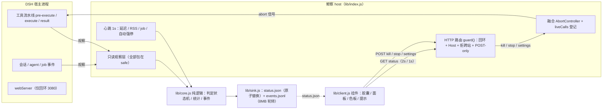
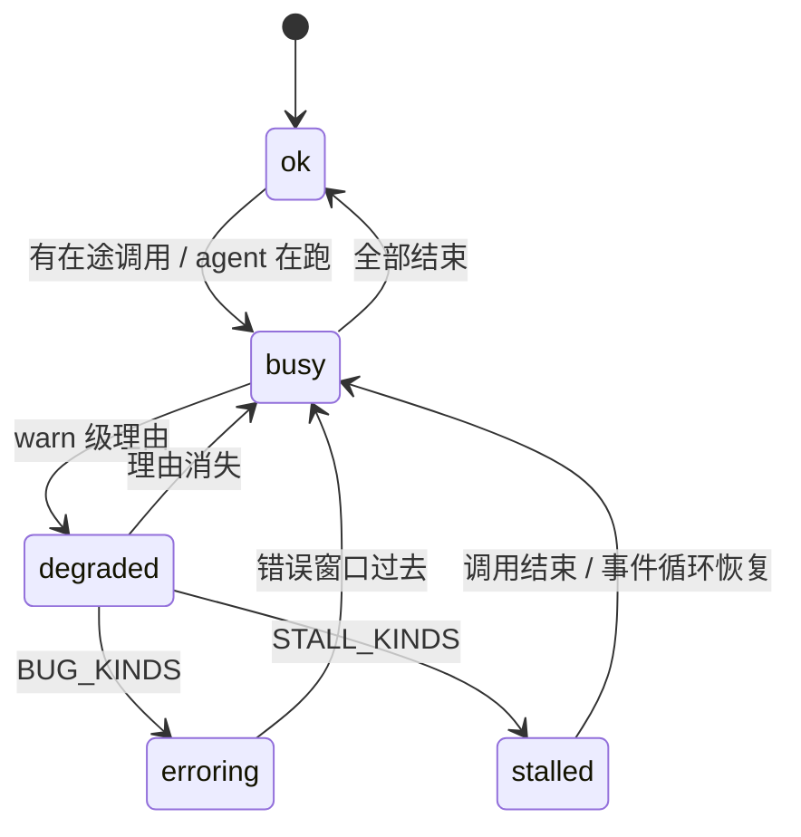
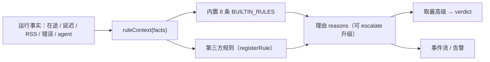

# 架构与状态机

> 这一页给"想改代码"的人看：数据从哪来、状态怎么变、为什么这么设计。

## 一、组件与数据流

**一次工具调用的生命周期**

| 阶段 | 鲸察做什么 |
|---|---|
| pre-execute | 记开始时间与参数摘要；**装上自己的 AbortController 并替换 exec.signal**；登记进 liveCalls（所以"还没派发"也能被停） |
| 等待审批 | 记 approval-wait（避免把"等用户点确认"误判成卡死） |
| execute | 阶段升级为 running（按 callId 幂等）；拿到声明的超时 |
| 执行中 | 心跳每秒：事件循环延迟、RSS、在途进度心跳、tool.progress |
| result | 记结果 / 错误分类 / 取消；还原 exec.signal、摘掉登记（兜底释放） |

## 二、判定状态机

**优先级**：stalled > erroring > degraded > busy / ok。只要存在对应级别的理由就取最高级，
所以"一个卡住的调用"不会被"一堆小告警"淹没。

| 级别 | 理由（reason kind） |
|---|---|
| stalled（STALL_KINDS） | tool-stall · tool-hang · no-progress · event-loop-blocked |
| erroring（BUG_KINDS） | error-storm · failure-loop · agent-error-loop · plugin-error |
| degraded（warn/high） | tool-slow · event-loop-lag · progress-slow · approval-wait · memory-leak |

## 三、理由与去处

| kind | 级别 | 判据（默认） | 会写进 |
|---|---|---|---|
| tool-slow | warn | 单次调用 ≥ 30s | 判定 / 事件 |
| tool-hang | high | 在途 ≥ 2min | 判定 / 事件 / 告警 |
| tool-stall | critical | 在途 ≥ 5min | 判定 / 事件 / 告警 |
| event-loop-lag | warn | 延迟 ≥ 500ms | 判定 / 告警 |
| event-loop-blocked | critical | 延迟 ≥ 5s | 判定 / 告警 |
| progress-slow | warn | 有 agent 在跑但 ≥ 15s 无输出 | 判定 |
| no-progress | critical | 有 agent 在跑但 ≥ 90s 无输出 | 判定 / 告警 |
| approval-wait | warn | 审批等待 ≥ 20s | 判定 / 告警 |
| error-storm | critical | 同工具窗口内失败 ≥ 3 次 | 判定 / 告警 |
| failure-loop | high | 同工具连续失败 ≥ 3 次 | 判定 / 告警 |
| agent-error-loop | critical | 模型/会话层错误 ≥ 3 次 | 判定 / 告警 |
| memory-leak | warn | RSS 连续 5 个心跳递增且增幅 > 10% | 判定 / 事件 / 告警 |
| plugin-error | critical | 鲸察自己抛异常（近 10 分钟） | 判定 / 告警 / 事件 |

## 四、判定规则可编排

判定不再是一条长 if 链，而是**规则表**：运行事实进来，逐条规则给理由，最后取最高级。

- **内置 8 条**：`inflight-calls` / `event-loop` / `memory-leak` / `no-progress` / `error-storm` / `failure-loop` / `agent-error-loop` / `plugin-error`（顺序固定，来源标 `builtin`）；
- **注册 API**（core 导出）：`registerRule({ id, title, evaluate, escalate?, replace? })`、`unregisterRule(id)`、`setRuleEnabled(id, on)`、`listRules()`；id 必须匹配 `^[a-z0-9][a-z0-9._-]{0,63}$`，重复 id 默认拒绝（`replace: true` 才覆盖）；
- **升级语义**：规则返回的理由可带 `escalate: 'stall'`，把 warn 级理由直接升到 stalled；第三方 `severity: critical` 默认按 bug 升到 erroring；
- **失败隔离**：单条规则的 `evaluate` 抛错只记账（`failures` 计数 + `plugin.error` 事件，同一规则 5 分钟最多报一次），**不影响其它规则与判定**；
- **配置开关**：`disabledRules: []` 按 id 停用内置规则（停用后仍出现在 `listRules()` 里，`enabled: false`）。

## 五、会话维度过滤

多会话并行时，挂件可以只看「我正在看的那个会话」：

- `GET /api/jingcha/status?session=<id>` 把同一个 `sessionId` 透传给 `verdict()` 与 `snapshot()`；
- **只有会话级理由受过滤影响**（`SESSION_SCOPED_KINDS`：tool-stall / tool-hang / tool-slow / no-progress / progress-slow）；宿主级理由（事件循环、插件自身报错等）永远算「现在」；
- 带过滤时每条理由标 `scope: session|host`，判定与明细用同一口径（快照的 `work.inflight` 也按同一个 `sessionId` 裁）；
- `work.sessions` 是**全局**汇总（`sessionSummary()`：每个会话的在途数 / agent 数 / 最久调用 / 空闲时长）——否则挂件没法列出会话让你选；
- 不传 `?session=`（或传空串）= 全局，且理由**不带** `scope` 字段，保持 v0.4 的响应形状不变。

## 六、挂件时间线

面板里的一条最近 **5 分钟**的判定时间线（30 段，每段 10 秒）：

- **数据在客户端本地累积**：每次轮询把「时间 + 判定级别 + 理由摘要」记进本地历史（上限 150 点），不新增宿主接口、不多占一份磁盘；
- **有界**：超过上限裁掉最老采样；理由每条截断、最多留 4 条；色块的 `data-level` 就是判定级别，空档不写内联色（交给 CSS 的 `--j-track`）；
- **轮询只改色与 title，不重建色块 DOM**——否则悬停会闪、折叠状态会丢（与「不要在轮询里重建交互控件」是同一个坑）；
- 折叠键 `timeline` 进 `LOCAL_DEFAULTS.fold`，与面板其它段落一致。

## 七、为什么这么设计

1. **只读优先**：所有观察路径包在 safe() 里，异常只记账（counters.pluginErrors + plugin.error 事件），
   **绝不改写 exec、结果或取消语义** —— 监察不该成为新的故障源。
2. **在 pre-execute 就装控制器**：DSH 的子调用（父 id 加 :ptc: 序号）不一定会走到 tools/execute，
   只在 execute 登记会让"停这个调用"变成空转（实测踩到的真 bug）。
3. **上游取消语义不变**：我们只是把"自己的信号"接进链子，DSH 派发时会把 callerSignal 与它融合；
   上游取消照旧生效，我们也能主动掐断，调用结束再还原。
4. **判定在 core、接线在 index**：core 零依赖、可单测（离线自检 179 项里绝大多数只依赖它）；
   宿主侧只做"取事实 + 落盘 + 暴露接口"。
5. **挂件轮询只重画数据视图**：交互控件（滑块、色板）绝不在轮询里重建，
   否则用户正拖的滑块会被换掉（历史真 bug：顿挫 + 色板消失）。
6. **单一基底色**：胶囊、面板、色板、提示框都从同一个底色派生，字色按底色亮度选，
   避免"深色界面里冒出一块白底白字"。
